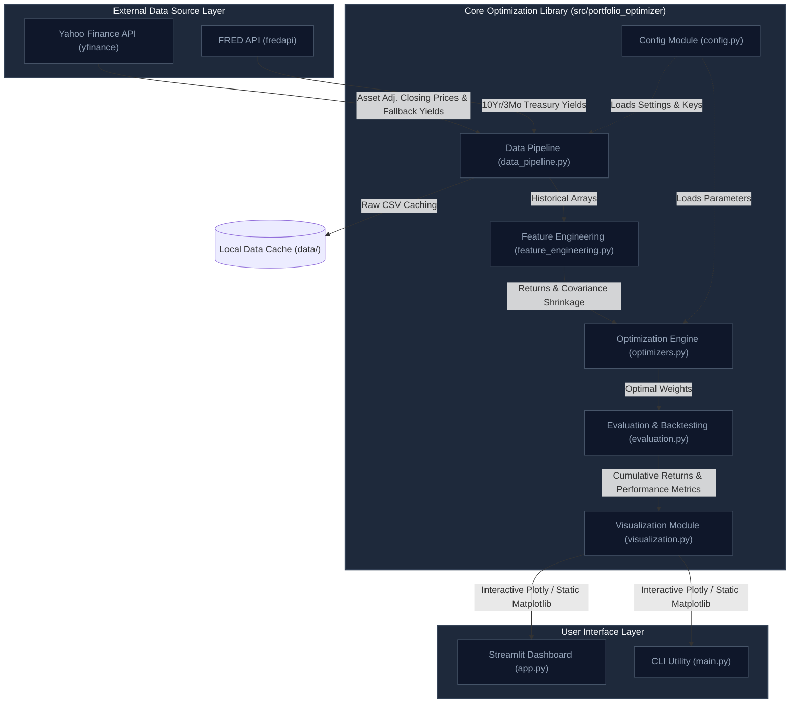
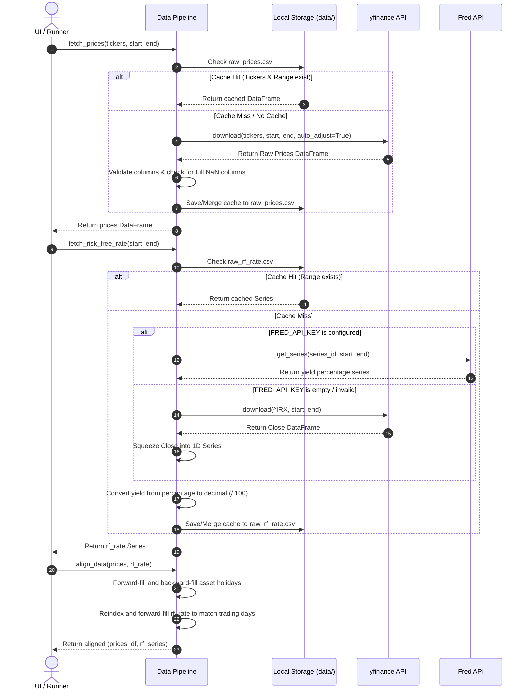
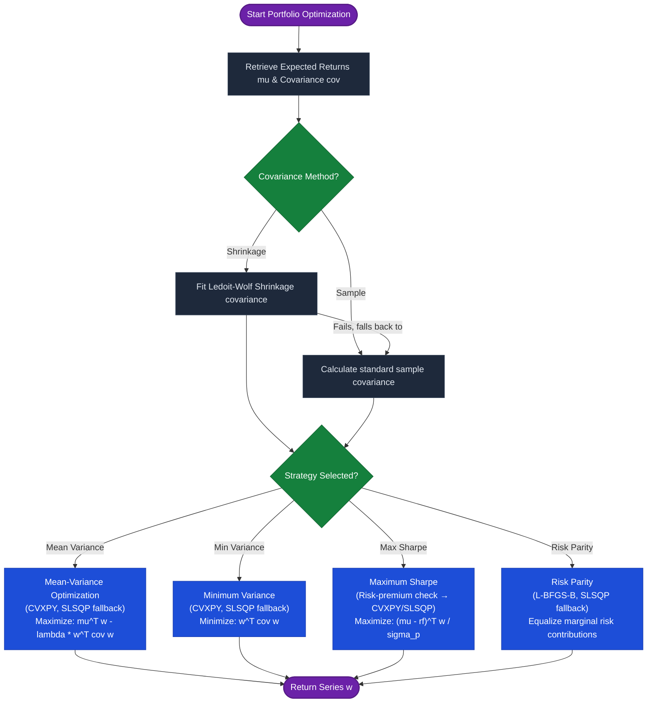
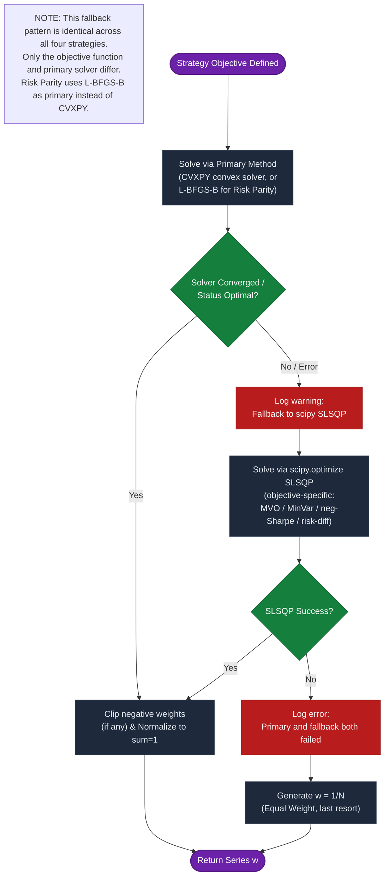
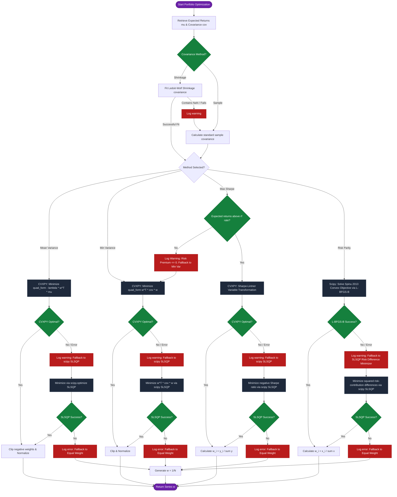

# Systems Architecture & Data Flow

This document details the modular software engineering design, data flow patterns, and optimization fallback mechanisms implemented in the Smart Beta Portfolio Optimizer.

---

## 1. High-Level System Architecture

The application is structured into decoupled layers, ensuring separate concerns for configuration, data ingestion, feature estimation, convex solving, evaluation, and interface renderers.

---

## 2. Ingestion Sequence & Date Alignment Flow

The data pipeline fetches asset prices and interest rates, aligns trading day calendars, cleans missing quotes, and caches raw results to disk to prevent redundant web calls.

---

## 3. Mathematical Optimization & Fallback Pathway

When optimization tasks are triggered, the engine primarily attempts to solve quadratic programs via CVXPY. If solvers experience convergence errors or negative risk premiums, they transition through fallback steps.

### Strategy Selection Overview

### Generic Solver Fallback Chain

